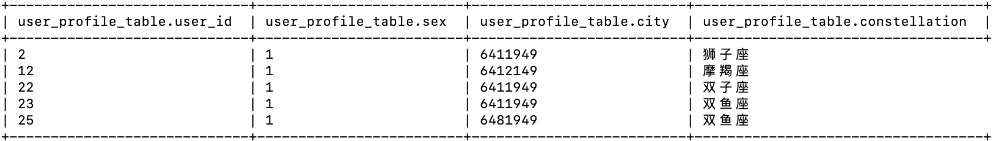
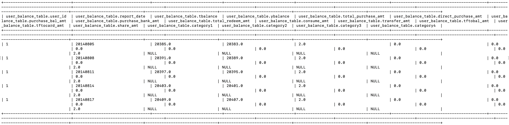
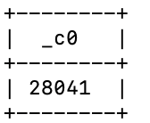
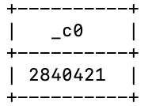
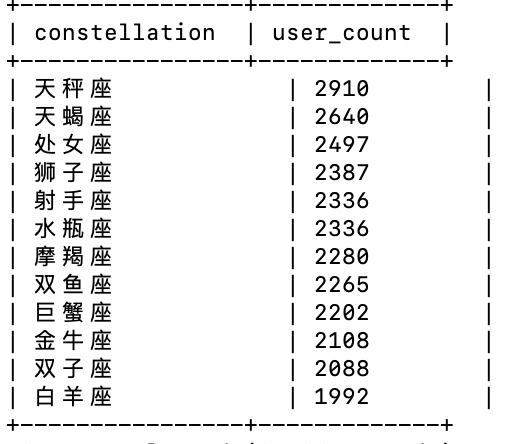
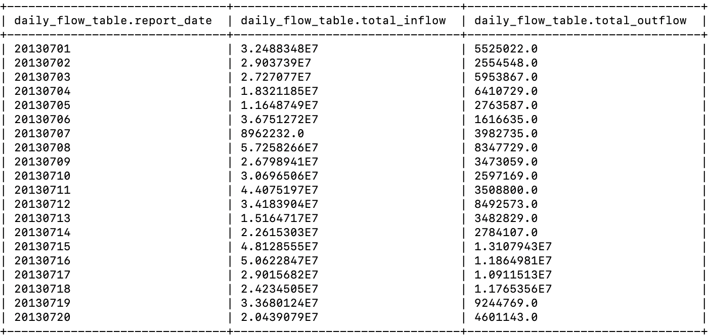
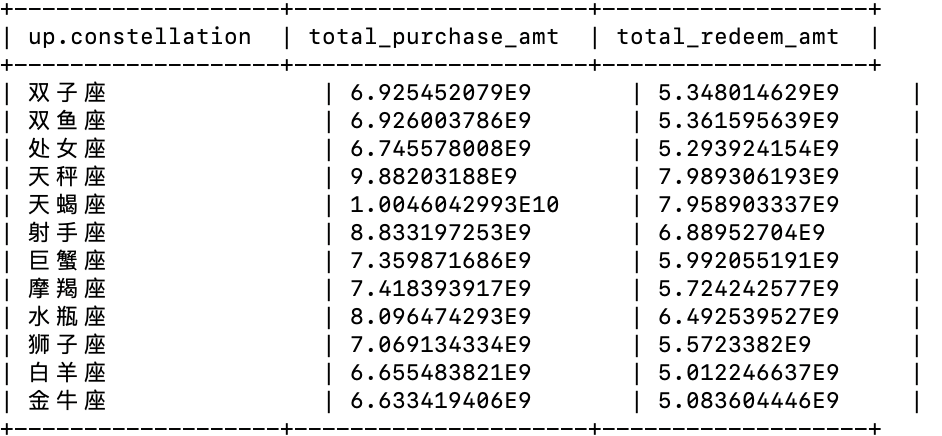
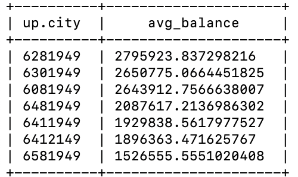
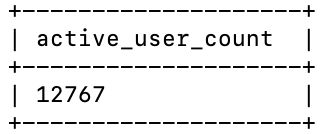
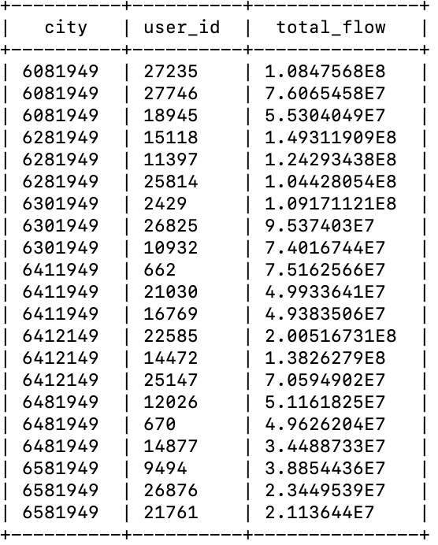

# 221275043 谢俊言 lab3
## I. 拉取hive4.0.0镜像，启动容器
```shell
1. docker pull apache/hive:4.0.0
2. export HIVE_VERSION=4.0.0
3. docker run -d -p 10000:10000 -p 10002:10002 --env SERVICE_NAME=hiveserver2 --name hive4 apache/hive:${HIVE_VERSION}
4. docker exec -it hive-server2 beeline -u 'jdbc:hive2://localhost:10000/'
```
## II. 数据准备
```shell
1. docker cp /User/jyxie/user_profile.csv hive4:/tmp/user_profile.csv
2. docker cp /User/jyxie/user_balance.csv hive4:/tmp/user_balance.csv
```

## III. 任务1：创建user_profile_table和user_balance_table并载入数据
```sql
1.  CREATE TABLE user_profile_table (
    user_id STRING,
    sex STRING,
    city STRING,
    constellation STRING
    )
    ROW FORMAT DELIMITED
    FIELDS TERMINATED BY ','
    STORED AS TEXTFILE
    TBLPROPERTIES ("skip.header.line.count"="1");

2.  CREATE TABLE user_balance_table (
    user_id STRING,
    report_date STRING,
    tBalance DOUBLE,
    yBalance DOUBLE,
    total_purchase_amt DOUBLE,
    direct_purchase_amt DOUBLE,
    purchase_bal_amt DOUBLE,
    purchase_bank_amt DOUBLE,
    total_redeem_amt DOUBLE,
    consume_amt DOUBLE,
    transfer_amt DOUBLE,
    tftobal_amt DOUBLE,
    tftocard_amt DOUBLE,
    share_amt DOUBLE,
    category1 DOUBLE,
    category2 DOUBLE,
    category3 DOUBLE,
    category4 DOUBLE
    )
    ROW FORMAT DELIMITED
    FIELDS TERMINATED BY ','
    STORED AS TEXTFILE
    TBLPROPERTIES ("skip.header.line.count"="1");

3.  LOAD DATA LOCAL INPATH '/tmp/user_profile.csv' INTO TABLE user_profile_table;
    LOAD DATA LOCAL INPATH '/tmp/user_balance.csv' INTO TABLE user_balance_table;

4.  SELECT * FROM user_profile_table LIMIT 5;
    SELECT * FROM user_balance_table LIMIT 5;
    SELECT COUNT(*) FROM user_profile_table;
    SELECT COUNT(*) FROM user_balance_table;
```
依次得到如下四张图：






## IV. 任务2: 基本数据查询
### 任务2.1：查询星座用户数量
```sql
SELECT
  constellation,
  COUNT(*) AS user_count
FROM
  user_profile_table
GROUP BY
  constellation
ORDER BY
  user_count DESC;
```
结果如下图：


### 任务2.2：查询特定日期的资金流入和流出情况
```sql
1.  CREATE TABLE daily_flow_table AS
    SELECT
    report_date,
    SUM(total_purchase_amt) AS total_inflow,
    SUM(total_redeem_amt) AS total_outflow
    FROM
    user_balance_table
    GROUP BY
    report_date;
2.  SELECT * FROM daily_flow_table LIMIT 20;
```
结果如下图：


## V. 任务3：数据聚合分析
### 任务3.1：按星座统计总购买量和总赎回量
```sql
SELECT
  up.constellation,
  SUM(ub.total_purchase_amt) AS total_purchase_amt,
  SUM(ub.total_redeem_amt) AS total_redeem_amt
FROM
  user_profile_table up
JOIN
  user_balance_table ub
ON
  up.user_id = ub.user_id
GROUP BY
  up.constellation;
```
结果如下图：


### 任务3.2:按城市统计2014.3.1的平均余额
```sql
SELECT
  up.city,
  AVG(ub.tBalance) AS avg_balance
FROM
  user_profile_table up
JOIN
  user_balance_table ub
ON
  up.user_id = ub.user_id
WHERE
  ub.report_date = '20140301'
GROUP BY
  up.city
ORDER BY
  avg_balance DESC
LIMIT 10;
```
结果如下图：



## VI.任务4:复杂查询与分析
### 任务4.1:活跃用户分析
```sql
SELECT COUNT(DISTINCT user_id) AS active_user_count
FROM (
  SELECT
    user_id,
    COUNT(DISTINCT report_date) AS active_days
  FROM
    user_balance_table
  WHERE
    report_date BETWEEN '20140801' AND '20140831'
  GROUP BY
    user_id
  HAVING
    active_days >= 5
) AS temp;
```
结果如下图：


### 任务4.2:统计每个城市总流量前3高的用户
```sql
1.  CREATE VIEW user_monthly_flow AS
    SELECT
    user_id,
    SUM(total_purchase_amt + total_redeem_amt) AS total_flow
    FROM
    user_balance_table
    WHERE
    report_date BETWEEN '20140801' AND '20140831'
    GROUP BY
    user_id;
    
2.  SELECT
    city,
    user_id,
    total_flow
    FROM (
    SELECT
        up.city,
        umf.user_id,
        umf.total_flow,
        ROW_NUMBER() OVER (PARTITION BY up.city ORDER BY umf.total_flow DESC) AS rank
    FROM
        user_monthly_flow umf
    JOIN
        user_profile_table up
    ON
        umf.user_id = up.user_id
    ) sub
    WHERE
    sub.rank <= 3;
```
结果如下图：



## VII. 实验感受
遇到的问题：hive3.1.3与java11兼容性存在着一些问题

解决方法：使用官方的hive4.0.0 docker镜像
